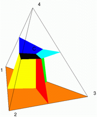
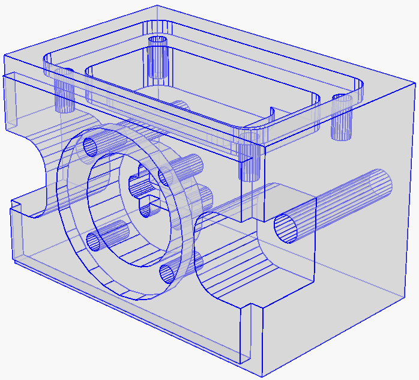
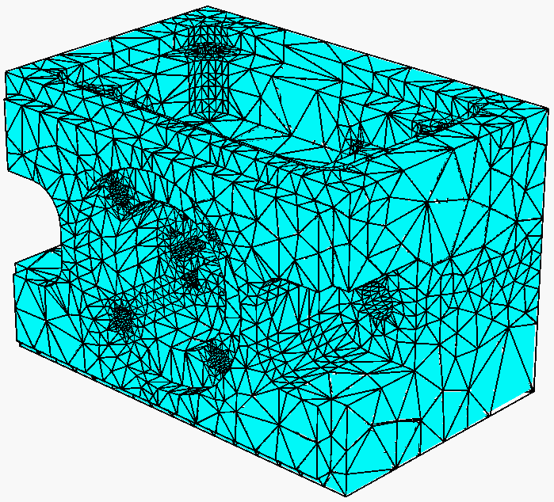
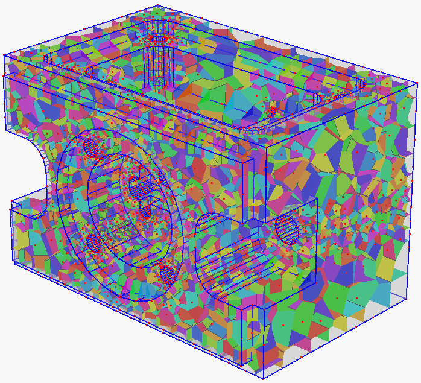

TetGen - A Quality Tetrahedral Mesh Generator and a 3D Delaunay Triangulator
=============================================================================
This  is a draft homepage for the TetGen mesh generator. For up-to-date information,
see the [TetGen repository](https://codeberg.org/Tetgen/TetGen).

TetGen is a program to generate tetrahedral meshes of any 3D
polyhedral domains. TetGen generates exact constrained Delaunay
tetrahedralizations, boundary conforming Delaunay meshes, and Voronoi
partitions. The following pictures respectively illustrate a 3D
polyhedral domain (left), a boundary conforming Delaunay tetrahedral
mesh (middle), and its dual - a Voronoi partition (right).

 
 
 

TetGen provides various features to generate good quality and adaptive
tetrahedral meshes suitable for numerical methods, such as finite
element or finite volume methods. For more information of TetGen,
please take a look at a list of [features](features.md).

TetGen is written in C++. It can be compiled into either a standalone
program invoked from command-line or a library for linking with other
programs.  All major operating systems, e.g. Unix/Linux, MacOS,
Windows, etc, are supported.

